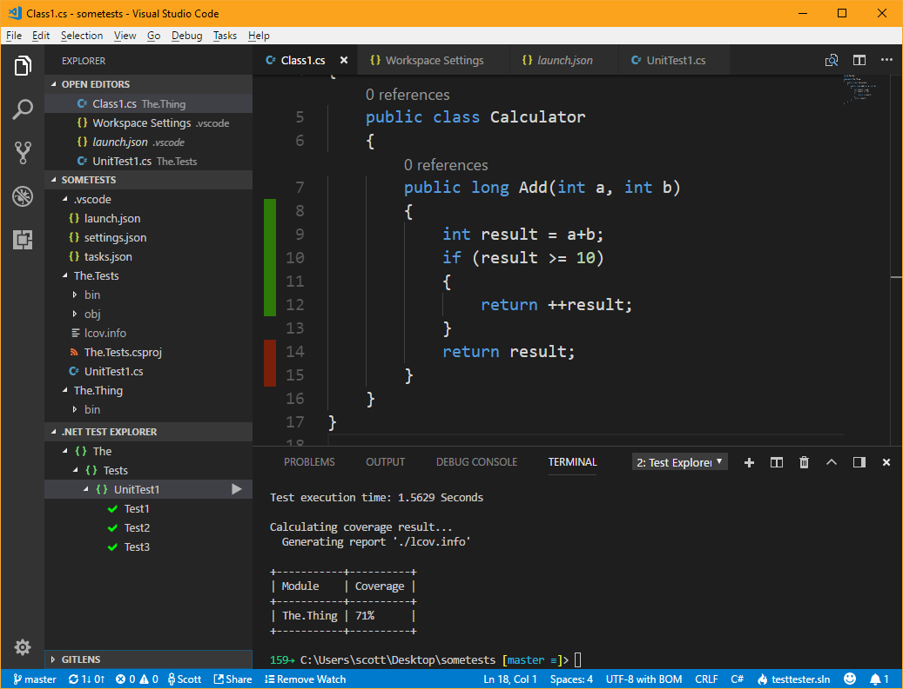

Using VS Code, https://github.com/tonerdo/coverlet/, xUnit, plus these extensions

- [Coverage Gutters](https://marketplace.visualstudio.com/items?itemName=ryanluker.vscode-coverage-gutters)
    - Reads in the lcov.info file (name matters) and highlights lines with color
- [.NET Core Test Explorer](https://marketplace.visualstudio.com/items?itemName=formulahendry.dotnet-test-explorer)
    - Discovers tests and gives you a nice explorer.



Note the tasks.json, specifically this part. If you name the file lcov.info, the Coverage Gutters extension will pick up and color the line numbers.

```
        {
            "label": "test with coverage",
            "command": "dotnet",
            "type": "process",
            "args": [
                "test",
                "/p:CollectCoverage=true",
                "/p:CoverletOutputFormat=lcov",
                "/p:CoverletOutput=./lcov.info",
                "${workspaceFolder}/The.Tests/The.Tests.csproj"
            ],
            "problemMatcher": "$msCompile",
            "group": {
                "kind": "test",
                "isDefault": true
            }
        },
```
